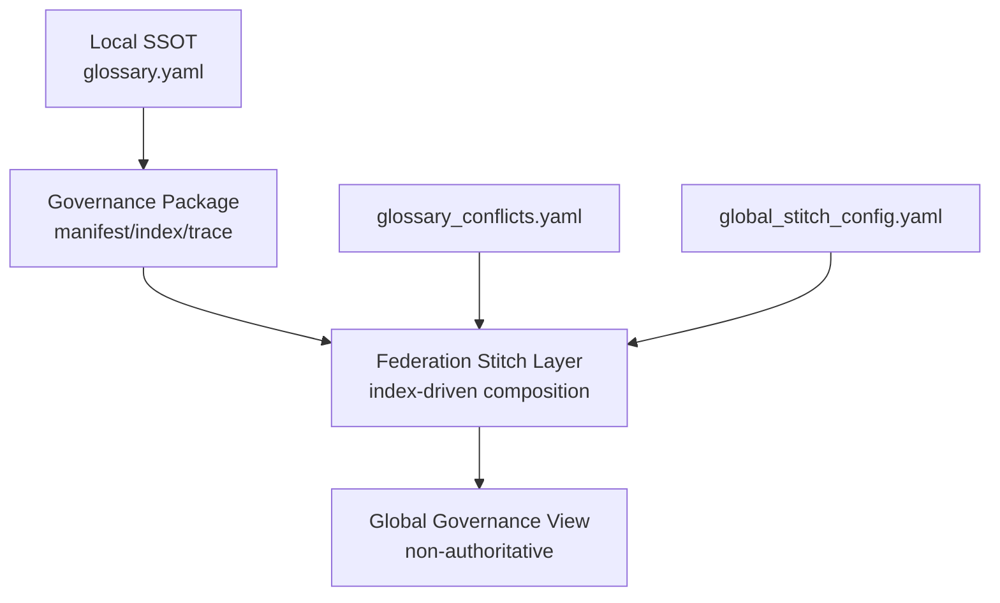

# GEMINI Governance Architecture

This package defines a local-first governance model for GEMINI.

- **SPINE**: local governance framework and operating contract.
- **Federation**: cross-repository composition by stitching indexes.
- **Local SSOT**: `docs/governance/glossary.yaml` is authoritative for GEMINI terms.
- **Global Stitching**: federated output is derived from local artifacts and never overrides local definitions.

## ASCII Diagram

```text
+-------------------------------+
| GEMINI Local SSOT             |
| docs/governance/glossary.yaml |
+---------------+---------------+
                |
                v
+-------------------------------+
| Local Governance Package       |
| manifest, index, trace, rules |
+---------------+---------------+
                |
                v
+-------------------------------+
| Federation Stitch Layer        |
| index-driven composition only |
+---------------+---------------+
                |
                v
+-------------------------------+
| Global Governance View         |
| non-authoritative aggregate   |
+-------------------------------+
```

## Mermaid Diagram


